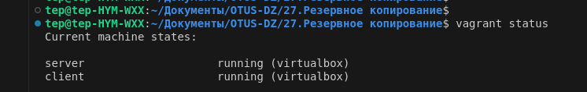

#  Резервное копирование с помощью утилиты Borg


Цель домашнего задания
Научиться настраивать резервное копирование с помощью утилиты Borg


__Настроить стенд Vagrant с двумя виртуальными машинами: backup_server и client__

[Vagrantfile](Vagrantfile) без подсказки

  


__Устанавливаем на client и backup сервере borgbackup__


  


__На сервере backup создаем пользователя и каталог /var/backup (в домашнем задании нужно будет создать диск ~2Gb и примонтировать его) и назначаем на него права пользователя borg__  

  


### 2.Определить разницу между контейнером и образом.


__Контейнер__  
При запуске контейнерной среды внутри контейнера создается копия файловой системы (docker образа) для чтения и записи.
Контейнер Docker (Docker Container) - это виртуализированная среда выполнения, в которой пользователи могут изолировать 
приложения от хостовой системы. Эти контейнеры представляют собой компактные портативные хосты, в которых можно быстро 
и легко запустить приложение.
Контейнеры работают автономно, изолированно от основной системы и других контейнеров, и потому ошибка в одном из них 
не влияет на другие работающие контейнеры, а также поддерживающий их сервер.  
Один `Docker`-контейнер = 1 сервис, сами контейнеры создаются из образов `image`. Так же можно внести изменения в работающем контенере, потом закоммитить его и получить новый образ.
```php
docker commit 1e6229dd21rd nginxnew:v1.2
```


дного образа.
    


### 3. Можно ли в контейнере собрать ядро?

Сборка ядра в контейнере возможна, считается любая сборка проекта в контейнере из исходного кода удобным вариантом для последующей доставки. 

https://github.com/a13xp0p0v/kernel-build-containers


### 4.Собранный образ запушить в docker hub.

  

  

[Ссылка на репозиторий docker hub](https://hub.docker.com/repository/docker/etevrizov/mynginx/general)


