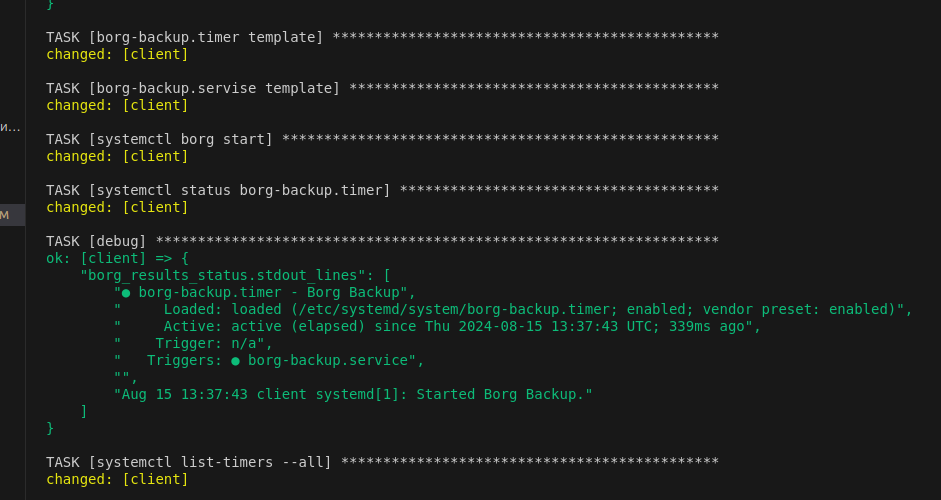

#  Резервное копирование с помощью утилиты Borg


Цель домашнего задания
Научиться настраивать резервное копирование с помощью утилиты Borg


### 1.Настроим стенд Vagrant с двумя виртуальными машинами: backup_server и client.

[Vagrantfile](Vagrantfile)

  


### 2.Пишем playbook

[playbook](playbook.yml)


__Устанавливаем на client и backup сервере borgbackup__
  


__На сервере backup создаем пользователя и каталог /var/backup и назначаем на него права пользователя borg__  
  


__На сервер backup создаем каталог ~/.ssh/authorized_keys в каталоге /home/borg__
  


__На клиенте создаем и копируем ssh key__
  


__Инициализируем репозиторий borg на backup сервере с client сервера / Запускаем для проверки создания бэкапа__
 
  


__Автоматизируем создание бэкапов с помощью systemd. Создаем сервис и таймер в каталоге /etc/systemd/system/__
 
 


__Проверяем работу таймера__

 
 


```php
docker commit 1e6229dd21rd nginxnew:v1.2
```
